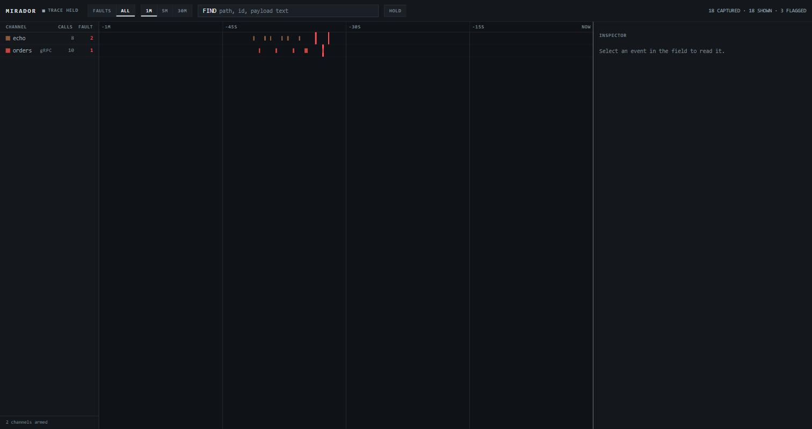

# Mirador

Un proxy que captura el tráfico de desarrollo local. Apunta un cliente a Mirador
en vez de al servicio con el que habla, y cada request y cada response que lo
cruza queda disponible para buscar.

Existe porque depurar entre servicios suele significar leer logs de varios
contenedores, y ninguno contiene el payload. `mitmproxy` resuelve esto muy bien
para HTTP. Para gRPC no hay nada que lo resuelva: `grpcurl` y `grpcui` hacen
llamadas, no observan las que tus servicios se hacen entre sí. Ese es el hueco
al que apunta.

[](https://github.com/NicolasCondezaR/mirador/actions/workflows/ci.yml)

*[Read me in English](README.md).*



> **Estado: fase 5.** Captura, decodificación, almacenamiento, búsqueda, la API
> de consulta, la interfaz de operación, el replay y el diff estructural
> funcionan, y todo se levanta con `docker compose up`. Ver
> [Hoja de ruta](#hoja-de-ruta).

## Cómo funciona

Mirador es un proxy explícito: un puerto de escucha por cada servicio observado.
Nada se intercepta a tus espaldas, y un servicio que no está configurado no se
captura.

```
cliente ──▶ mirador :9101 ──▶ tu servicio :3000
                │
                └──▶ SQLite ──▶ API de consulta :9000
```

Dos propiedades sostienen el diseño:

- **El reenvío es byte a byte.** Un depurador que altera el tráfico invalida
  toda conclusión que se saque de él. Los cuerpos de request y response pasan
  intactos, sin importar cuánto de ellos se almacene.
- **Los bytes guardados son el dato.** Los cuerpos se guardan exactamente como
  cruzaron el cable y se decodifican solo al mostrarlos. Re-serializar perdería
  campos desconocidos y reordenaría claves, que es justo lo que vuelve inútil un
  replay — y así una captura se puede volver legible más adelante, cuando
  aparezca su esquema.

## Inicio rápido

### Con Docker

```bash
docker compose up -d
```

Esto levanta Mirador más dos servicios de juguete para tener algo que capturar:
`echo` en HTTP y `grpcdemo` en gRPC. Sus propios puertos no se publican a
propósito: el tráfico debe llegar a través del proxy.

Abre **http://127.0.0.1:9000** y mándale algo:

```bash
curl http://127.0.0.1:9101/ok                 # HTTP, through Mirador
curl 'http://127.0.0.1:9101/fail?status=503'  # a fault, to see one flagged
grpcurl -plaintext -d '{"order_id":"ORD-1"}' \
  127.0.0.1:9201 demo.v1.Orders/GetOrder      # gRPC, through Mirador
```

### Sin Docker

```bash
go build -o mirador ./cmd/mirador
go build -o echo ./examples/echo
go build -o grpcdemo ./examples/grpcdemo

cp mirador.example.yaml mirador.yaml
./echo -addr 127.0.0.1:8081 &
./grpcdemo -addr 127.0.0.1:8082 &
./mirador -config mirador.yaml
```

## La interfaz

Mirador se lee como un analizador lógico y no como una tabla de requests, porque
una tabla responde "qué pasó" y nunca "qué estaba pasando al mismo tiempo", que
es la pregunta cuando hablan quince servicios y uno se rompió.

- **Riel de canales.** Una fila por target, con su color tomado del código de
  las puntas de prueba, su total de llamadas y su total de fallos. Los conteos
  no están filtrados: el riel responde "¿está sano este servicio?", así que un
  filtro puesto delante del campo no puede cambiarlo.
- **Campo de eventos.** Un carril por canal contra un eje de tiempo vivo cuyo
  borde derecho es ahora. Una llamada es una marca cuyo ancho es su duración; y
  **un fallo es una forma distinta** —una barra de alto completo— para que
  sobreviva a un canal rojo, a un lector daltónico y a una mirada de reojo.
- **Inspector.** La llamada seleccionada, decodificada, indicando de dónde salió
  el esquema.

Arranca filtrada a fallos, porque ese es el motivo por el que la abriste. `ALL`
cambia al campo completo. Dejar el puntero sobre el campo **congela el trazo**,
para que una marca deje de deslizarse mientras le apuntas; al salir, se reanuda.

`FIND` busca en rutas y en el texto de los payloads, incluidos los que Mirador
solo tiene como bytes. `/` enfoca el buscador y `Escape` cierra el inspector.

La interfaz completa va embebida en el binario: sin Node, sin paso de build, sin
peticiones de red y sin fuentes web.


Arriba: una llamada gRPC que devolvió `PermissionDenied`. El estado HTTP es 200
—gRPC reporta el fallo por debajo de HTTP— y la request aparece decodificada con
nombres de campo porque el servicio sirve reflection.

## PowerShell

PowerShell 5.1 reescribe las comillas al pasar argumentos a ejecutables
externos, de modo que `curl.exe` corrompe los cuerpos JSON en silencio:

```powershell
# WRONG — the upstream receives {sku:ABC-9}, quotes stripped
curl.exe -X POST -H "Content-Type: application/json" -d '{"sku":"ABC-9"}' http://127.0.0.1:9101/echo
```

Usa `Invoke-RestMethod`, o pon el cuerpo en un archivo:

```powershell
# Sends a body, and reads what Mirador captured
$body = @{ sku = 'ABC-9'; qty = 3 } | ConvertTo-Json -Compress
Invoke-RestMethod -Method Post -Uri http://127.0.0.1:9101/echo -ContentType 'application/json' -Body $body

(Invoke-RestMethod -Uri http://127.0.0.1:9000/api/calls).calls |
  Select-Object id, method, path, status, duration_ms | Format-Table

$id = (Invoke-RestMethod -Uri 'http://127.0.0.1:9000/api/calls?q=ABC-9').calls[0].id
(Invoke-RestMethod -Uri "http://127.0.0.1:9000/api/calls/$id").request.text
```

```powershell
# curl.exe is fine when the body comes from a file
curl.exe -X POST -H "Content-Type: application/json" --data-binary '@body.json' http://127.0.0.1:9101/echo
```

## gRPC

Pon `protocol: grpc` en un target y apúntalo al puerto del servicio. Mirador le
habla HTTP/2 en claro, reenvía la llamada intacta —trailers incluidos, que es
donde gRPC reporta si la llamada realmente funcionó— y decodifica los mensajes
cuando encuentra un esquema.

```bash
# through Mirador, not straight at the service
grpcurl -plaintext -d '{"order_id":"ORD-777"}' 127.0.0.1:9201 demo.v1.Orders/GetOrder

# only the calls that failed, across HTTP status, gRPC status and transport errors
curl 'http://127.0.0.1:9000/api/calls?failed=true'
```

### De dónde sale el esquema

Tres fuentes, probadas en orden, cada una degradando en la siguiente:

1. **Reflection.** Si el servicio la sirve, Mirador pregunta y no necesita nada
   más. Le pregunta al servicio directamente y no a través del proxy, para que
   su propia contabilidad no termine en tu línea de tiempo.
2. **Un descriptor set en disco.** Para servicios sin reflection, compila los
   protos y apunta al resultado:
   ```bash
   buf build -o descriptors.binpb
   # or: protoc --include_imports --descriptor_set_out=descriptors.binpb path/to/*.proto
   ```
   ```yaml
   - name: orders
     listen: 127.0.0.1:9201
     upstream: http://127.0.0.1:50051
     protocol: grpc
     descriptor_set: ./descriptors.binpb
     reflection: false
   ```
3. **El wire format mismo.** Sin ningún esquema, los mensajes igual vuelven como
   campos numerados con tipos adivinados y la estructura anidada intacta:
   ```json
   [
     {"number": 1, "type": "string",  "value": "ORD-777"},
     {"number": 2, "type": "varint",  "value": 3, "note": "could be an integer, a bool or an enum"},
     {"number": 3, "type": "message", "value": [...], "note": "guessed to be a nested message"}
   ]
   ```
   Las adivinanzas van marcadas como tales. En el cable un varint puede ser un
   int32, un bool o un enum, y decirlo es la diferencia entre una vista útil y
   una engañosa.

`GET /api/schemas` informa qué fuente resolvió cada target, y el motivo cuando
ninguna lo hizo. Es el primer endpoint que hay que mirar cuando faltan nombres
de campo.

Para saber si un servicio sirve reflection:

```bash
grpcurl -plaintext <host>:<port> list
```

### Qué cubre y qué no cubre el soporte de gRPC

- Las llamadas unarias, de server streaming y de client streaming se capturan
  completas, con cada mensaje de ambos lados, no solo el primero.
- El estado sale de los trailers, o de las cabeceras en una respuesta
  *trailers-only*, que es como un servidor reporta un error sin nada que enviar.
  Una llamada gRPC fallida igual lleva HTTP 200; el listado muestra ambos.
- `grpc-message` se decodifica del percent-encoding, así que un error en español
  se lee en español.
- Los mensajes comprimidos se reportan como comprimidos y no se decodifican. La
  codificación se negocia por llamada y adivinarla produciría basura con aire de
  certeza.
- Un target `grpc` igual reenvía el HTTP común que comparte el puerto —endpoints
  de salud y de métricas— y lo clasifica por el content type y no por cómo se
  configuró el target.
- Las llamadas de reflection hechas *a través* del proxy se capturan como
  cualquier otro tráfico. Fíltralas con `?path=demo.v1` o con lo que calce con
  tus propios servicios.

## Replay y diff

Al seleccionar una llamada, el inspector ofrece **REPLAY**. La request sale de
nuevo construida desde los bytes que se guardaron, así que lo que llega al
servicio es lo mismo que llegó la primera vez.

Se envía **a través de Mirador** y no directo al upstream, lo que significa que
el reenvío se captura como cualquier otro tráfico: aparece en el campo, queda
enlazado a la llamada de la que salió, y ambas se pueden comparar de inmediato.

```bash
# replay a call onto the channel it came from
curl -X POST http://127.0.0.1:9000/api/calls/42/replay

# or onto another configured channel, to ask the same request of a second instance
curl -X POST http://127.0.0.1:9000/api/calls/42/replay \
  -H 'Content-Type: application/json' -d '{"target":"orders-staging"}'

curl 'http://127.0.0.1:9000/api/diff?a=42&b=43'
```

El replay solo apunta a un **canal configurado**. No existe un modo de URL
arbitraria: el caso útil es hacerle la misma request a otra instancia que ya
estás observando, y cualquier cosa más amplia convierte un depurador en un
forjador de requests.

**Una captura truncada no se puede reenviar, y Mirador se niega en vez de
intentarlo.** Solo se guardó la cabeza del cuerpo, así que lo que saldría no
sería lo que se capturó, y el resultado llevaría la palabra "replay" siendo una
request distinta. La negativa nombra el arreglo: subir `max_body_bytes` y volver
a capturar.

### El diff es estructural

Los cuerpos se comparan como estructuras parseadas, no como texto. Reordenar
claves o reindentar no son diferencias, así que la respuesta es una lista corta
de rutas en vez de un muro de rojo y verde:

```
~ qty          a 3          b 7
+ nota                      b urgente
```

- El orden de un arreglo **sí** es una diferencia —la posición tiene significado
  en un campo `repeated` de protobuf— mientras que el orden de las claves de un
  objeto no lo es.
- `1290000` y `"1290000"` son el mismo valor. protojson emite int64 como string,
  y reportar eso sería una afirmación sobre codificación, no sobre datos.
- Los streams de gRPC se comparan mensaje por mensaje, así que el mensaje 3 de 5
  puede diferir mientras el resto calza.
- La duración se excluye a propósito: cambia en cada replay y enterraría las
  diferencias que sí significan algo.
- Cuando un lado no es JSON, o no tiene esquema, el diff lo dice e informa si
  los bytes coinciden, en vez de inventar una comparación estructural.

## Qué guarda Mirador, y qué implica eso

Mirador escribe en un archivo SQLite los bytes que cruzaron el cable. **Eso
incluye lo que sea que lleve tu tráfico**: cabeceras `Authorization`, cookies de
sesión, claves de API, datos personales. No hay redacción, y es una decisión
deliberada y no un descuido: redactar significaría que la captura ya no es lo
que se envió, lo que rompe tanto la fidelidad sobre la que está construida la
herramienta como el replay junto con ella.

Lo que se desprende de eso:

- **La base de datos es un archivo plano sin cifrado**, donde sea que apunte
  `database:`. Trátalo como un archivo de logs con credenciales adentro, porque
  eso es.
- **Mirador no tiene autenticación.** Cualquiera que alcance su puerto puede
  leer todas las capturas. Déjalo en `127.0.0.1` —así viene configurado— y no
  publiques el puerto.
- **Es una herramienta de desarrollo local.** Apuntarla a tráfico de producción
  queda fuera de para qué fue construida y fuera de lo que cubre su modelo de
  amenazas.
- La retención acota cuánto viven las capturas, pero es un límite de aseo, no un
  control de seguridad.

## Configuración

Copia `mirador.example.yaml` a `mirador.yaml` y agrega una entrada por servicio.
Una clave desconocida es un error de arranque y no un valor por defecto
silencioso, así que una errata no se convierte en una hora de confusión.

```yaml
api_listen: 127.0.0.1:9000
database: mirador.db
max_body_bytes: 262144   # kept per body; the full body always reaches its destination
buffer_size: 1024        # captures buffered in memory before they are written

retention:
  max_calls: 50000
  max_age: 24h
  interval: 1m

targets:
  - name: admin-api
    listen: 127.0.0.1:9102
    upstream: http://127.0.0.1:3000
    protocol: http
```

Después apunta a `127.0.0.1:9102` lo que sea que llame a `admin-api`. El mismo
binario y el mismo archivo sirven para servicios en contenedores y para
servicios corriendo de forma nativa, que es justamente el punto: un stack local
de verdad suele ser las dos cosas.

Dentro de Docker, usa `host.docker.internal` para alcanzar un servicio que corre
en el host. Ver `mirador.docker.yaml`.

## API

| Método y ruta | Para qué |
|---|---|
| `GET /api/calls` | Lista las capturas, más recientes primero. Filtros: `target`, `method`, `path`, `status`, `protocol`, `grpc_status`, `failed`, `q`, `since`, `until`, `limit`, `before_id`. |
| `GET /api/calls/{id}` | Una captura con cabeceras y cuerpos. |
| `GET /api/targets` | Los targets configurados. |
| `GET /api/schemas` | Por cada target gRPC: qué fuente de esquema resolvió, o por qué ninguna. |
| `POST /api/calls/{id}/replay` | Reenvía la llamada, opcionalmente a otro canal. |
| `GET /api/diff?a=&b=` | Comparación estructural de dos llamadas. |
| `GET /api/stats` | Cantidad de capturas, rango de tiempo y llamadas descartadas bajo carga. |
| `GET /health` | Liveness. |

El listado no lleva cuerpos a propósito: unos cientos de llamadas con payloads
adjuntos es inusable. Los cuerpos vienen del endpoint de detalle, como `text`
cuando el contenido es UTF-8 válido y como `base64` cuando no lo es. La API
nunca adivina: informa qué son los bytes.

`q` busca en rutas y en payloads de texto. Se trata como una frase literal, así
que `"sku":"ABC-9"` y `/v1/orders` funcionan tal como se escriben en vez de
leerse como operadores de consulta.

## Comportamiento que conviene conocer

- **La captura nunca retrasa el tráfico.** Las escrituras ocurren en una
  goroutine aparte detrás de un búfer acotado. Ante una ráfaga, se descartan
  capturas antes que frenar el sistema que estás intentando observar — y
  `GET /api/stats` informa cuántas se perdieron, para que la pérdida sea visible
  en vez de silenciosa.
- **Los cuerpos grandes se truncan solo en el almacén.** Una request de 500 KB
  con un tope de 256 KB se reenvía completa y se guarda como 256 KB, marcada
  como `truncated`, con `size` informando los 500 KB reales.
- **El texto mal codificado igual se puede buscar.** Un acento en latin-1 de un
  servicio que nunca arregló su charset no vuelve inencontrable la llamada; el
  índice se sanea mientras los bytes guardados quedan exactos. Los payloads
  realmente binarios no se indexan.
- **Un upstream inalcanzable también se captura.** Mirador responde 502 y
  registra el error de transporte, así que el fallo está en la línea de tiempo
  en vez de faltar. Un 502 que vino del upstream mismo tiene el campo `error`
  vacío.
- **La retención corre por temporizador**, aplicando primero la antigüedad y
  después el tope de filas.
- **Ctrl+C drena el búfer** antes de salir.

## Hoja de ruta

| Fase | Alcance | Estado |
|---|---|---|
| 1 | Captura HTTP, almacenamiento, búsqueda, API de consulta | listo |
| 2 | gRPC: h2c, trailers, desenmarcado, decodificación de protobuf | listo |
| 3 | Interfaz web con línea de tiempo en vivo | listo |
| 4 | Replay y diff estructural | listo |
| 5 | Empaquetado y documentación | listo |
| 6 | TUI, como segundo cliente de la misma API | siguiente |

### Limitaciones

- Solo tráfico en claro. Un upstream con TLS se reenvía pero no se puede
  inspeccionar.
- Sin captura de WebSocket ni SSE.
- Los mensajes gRPC comprimidos no se descomprimen.
- La cabecera `Host` se reescribe al upstream, como en cualquier reverse proxy.
- Una captura truncada no se puede reenviar; la negativa es deliberada.
- La interfaz no tiene cursores ni trigger, dos dispositivos que un instrumento
  real sí tiene, y el siguiente alcance evidente.

## Desarrollo

```bash
go test ./...
go vet ./...
go run ./cmd/mirador -version   # the commit a binary came from
```

El detector de carreras necesita cgo, y este proyecto deliberadamente no
necesita toolchain de C (el driver de SQLite es Go puro), así que `go test
-race` corre en CI y no en una estación de trabajo Windows. No es un trámite: el
proxy lee el cuerpo de una request en la goroutine del transporte mientras el
handler lee la captura.

Los tests usan archivos SQLite reales, servidores HTTP reales y un cliente y un
servidor gRPC reales; no hay mocks de ninguno.

`PRODUCT.md` y `DESIGN.md` contienen el registro de producto y el sistema
visual. La interfaz es HTML, CSS y JavaScript planos bajo `internal/web/static`,
servidos con `go:embed`; editarla no requiere toolchain, solo recompilar.

Después de cambiar `examples/grpcdemo/proto`, regenera el código Go y el
descriptor set commiteado:

```bash
go install github.com/bufbuild/buf/cmd/buf@latest
go install google.golang.org/protobuf/cmd/protoc-gen-go@latest
go install google.golang.org/grpc/cmd/protoc-gen-go-grpc@latest

buf lint
buf generate
buf build -o examples/grpcdemo/descriptors.binpb
```

`buf` es un compilador en Go puro, así que no hace falta instalar `protoc`. Un
test falla si el descriptor set commiteado se desincroniza del código generado.
